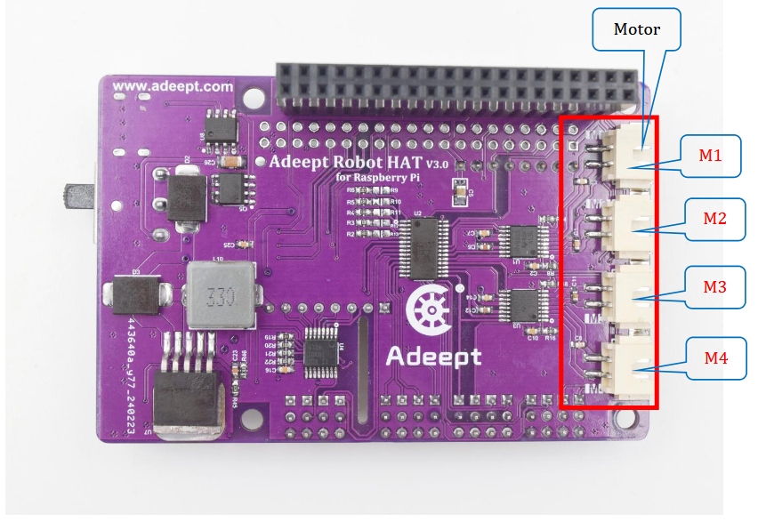

## Overview

The **Adeept Robot HAT V3.1** is a purple single‑board microcontroller that stacks directly on a Raspberry Pi.
It acts as the robot’s “brain”, providing power distribution, motor control, and a rich set of sensor/actuator interfaces.
The board is manufactured by **Adeept** (<https://www.adeept.com>) and is the reference controller for the **Adeept Rasptank‑Metal** robot platform.

> **Quick link** – [Download the full PDF manual](pdfs/Lesson%202%20Introduction%20of%20Adeept%20Robot%20HAT%20V3.1.pdf)

## Pin‑out / Mapping Table

The table below translates the **hardware labels** used on the HAT to the **Raspberry Pi GPIO numbers** (BCM) that the robot’s Python drivers use.
If you have the board schematic, verify the numbers and fill any missing entries.

| Symbol            | BCM GPIO                     | Physical Pin                  | Voltage | Function / Label on Board            | Notes                                     |
| ----------------- | ---------------------------- | ----------------------------- | ------- | ------------------------------------ | ----------------------------------------- |
| `VCC_5V`          | 2 (or 4)                     | 3 & 5                         | 5 V     | Power rail for servos & LEDs         | Must be able to source ≥ 4 A peak         |
| `GND`             | 6, 9, 14, 20, 25, 30, 34, 39 | 9, 11, 13, 15, 17, 21, 23, 25 | 0 V     | Common ground                        | Connect to all ground pins on Pi          |
| `M1_PWM`          | 12                           | 32                            | 3.3 V   | Motor 1 PWM (IN1)                    | PWM range 0‑255, 50 Hz – 1 kHz            |
| `M2_PWM`          | 13                           | 33                            | 3.3 V   | Motor 2 PWM (IN2)                    | Same as M1                                |
| `M3_PWM`          | 19                           | 35                            | 3.3 V   | Motor 3 PWM (IN3)                    |                                           |
| `M4_PWM`          | 26                           | 37                            | 3.3 V   | Motor 4 PWM (IN4)                    |                                           |
| `SERVO_1`         | 17                           | 11                            | 3.3 V   | Servo PWM channel 0                  | 500‑2500 µs pulse                         |
| `SERVO_2`         | 27                           | 13                            | 3.3 V   | Servo PWM channel 1                  |                                           |
| `SERVO_3`         | 22                           | 15                            | 3.3 V   | Servo PWM channel 2                  |                                           |
| `SERVO_4`         | 23                           | 16                            | 3.3 V   | Servo PWM channel 3                  |                                           |
| `IR_RX`           | 5                            | 10                            | 3.3 V   | Infrared receiver data               |                                           |
| `WS2812_DATA`     | 18                           | 12                            | 5 V     | WS2812 data line                     | 5 V tolerant, use level‑shifter if needed |
| `I2C_SCL`         | 3                            | 5                             | 3.3 V   | I²C clock                            | Pull‑up to 3.3 V required                 |
| `I2C_SDA`         | 2                            | 3                             | 3.3 V   | I²C data                             | Pull‑up to 3.3 V required                 |
| `UART_TX`         | 14                           | 8                             | 3.3 V   | UART TX (to host)                    |                                           |
| `UART_RX`         | 15                           | 10                            | 3.3 V   | UART RX (from host)                  |                                           |
| `ULTRASONIC_TRIG` | 24                           | 18                            | 3.3 V   | Trigger output                       | 10 µs pulse                               |
| `ULTRASONIC_ECHO` | 25                           | 22                            | 3.3 V   | Echo input                           |                                           |
| `LED_POWER`       | 4                            | 7                             | 3.3 V   | Power‑ON indicator (X5)              | LED on when board powered                 |
| `BAT_LOW`         | 21                           | 37                            | 3.3 V   | Low‑battery indicator (last red LED) |                                           |
| `BUZZER`          | 24                           | 18                            | 3.3 V   | Passive buzzer control               |                                           |

> **How to fill the table**
>
> 1. Open the schematic PDF (or the PCB layout file).
> 2. Locate each labeled connector (e.g., `M1`, `SERVO_1`, `IR_RX`).
> 3. Identify the Raspberry Pi pin that the schematic routes to (most Adeept docs label the pins with BCM numbers; if not, use the physical pin number and convert with the Pi GPIO table).
> 4. Populate the columns **BCM GPIO**, **Physical Pin**, **Voltage**, **Function**, and **Notes**.
> 5. If a signal is not directly tied to a Pi pin (e.g., a dedicated driver output), note that the Python driver creates the PWM channel internally – you can still expose the _symbolic name_ here for documentation purposes.

## Electrical Characteristics & Power Requirements

- **Nominal supply** – 5 V via USB‑C or barrel‑jack.
- **Peak current** – up to **3.75 A** when all servos are moving; a 4 A (or higher) source is strongly recommended.
- **Regulation** – The HAT contains a 5 V buck‑converter that feeds the motor driver; the Pi’s 5 V rail must stay within ±5 % under load.
- **Grounding** – All grounds (Pi, HAT, external battery, motor driver) must be tied together to avoid floating references.

## Mechanical / Connector Summary

| Connector               | Physical description                           | Typical use                                |
| ----------------------- | ---------------------------------------------- | ------------------------------------------ |
| **Type‑C USB**          | 24‑pin micro‑USB‑C receptacle                  | Power input & data transfer                |
| **Barrel‑Jack**         | 3‑pin 5.5 mm centre‑positive                   | External battery / power source            |
| **Motor Ports (M1‑M4)** | 4× white screw‑terminal block (2 × 2 mm pitch) | Connect external motor driver board        |
| **Servo Block**         | Red‑black‑yellow trio of terminals             | Individual servo power & signal            |
| **IR Receiver**         | 3‑pin IR module footprint                      | Remote‑control receiver                    |
| **WS2812 Port**         | 3‑pin header (5 V, GND, DIN)                   | Addressable RGB LED strip                  |
| **X1‑X9 I/O Block**     | Mixed header pins (see table)                  | I²C, UART, line‑tracking, ultrasonic, etc. |
| **LED Indicators**      | Surface‑mount LEDs (X5, RD15, battery‑LEDs)    | Status feedback                            |

## Software API (Python)

The HAT is exposed through the **`src.hardware.adeept_robot_hat`** package (to be created).
A minimal example that loads the pin‑mapping and drives a servo:

```python
from adeept_robot_hat import ServoController

# Initialise – reads the mapping from the YAML front‑matter
servo = ServoController(board="Adeept_Robot_HAT_V31")

# Move servo 1 (connected to SERVO_1) to 90°
servo.set_angle(channel=0, angle=90)

# Turn on the buzzer for 0.2 s
servo.buzzer.on(duration=0.2)
```

_All public methods (`set_angle`, `set_speed`, `read_ultrasonic`, etc.) will be documented in the `software_api.md` file that lives alongside this overview._

## Diagram & Images

.png>)

.png>)

> **Alt‑text:** “Purple Adeept Robot HAT V3.1 stacked on a Raspberry Pi, showing motor ports, servo block, and I²C header.”



## PDF Version

[Full technical manual (PDF)](pdfs/Lesson%202%20Introduction%20of%20Adeept%20Robot%20HAT%20V3.1.pdf)
